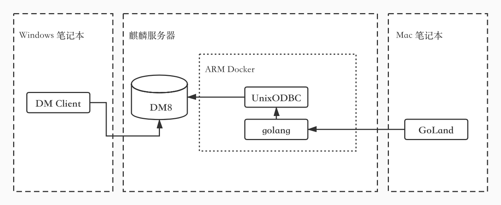

# beego-ORM 适配达梦

在选型设计的时候，主要考虑了以下几种 ORM：

| ORM 名称 | 可行性 | 优势 | 劣势 | 说明 |
| :--- | :--- | :--- | :--- | :--- |
| oci8 | 不可行 |  |  | 因为 DM 和 oracle 很像，所以尝试使用 oci 对接  测试时候发现发现：Open连接没有问题，但是Query的时候会报 Lost Connection  经在官网查询，及和达梦同学确认，发现这确实是不可行的死路 |
| XORM | 可行 | 好对接 | 内部没有使用经验  星少（6.2k） | 未进行对接尝试 |
| GORM@V1.0 | 可行 | 好对接 内部使用广泛 | 不再新增feature（已和作者确认） | 进行过对接尝试：ORM 和 Raw SQL 均可行 |
| GORM@V2.0 | 可行 | 星多（21.9k）  GORM@V1.0迁移过去的，质量有保障 | 内部同学曾尝试升级，单测不过，暂时搁置 | 未进行对接尝试 |
| beego ORM | 可行 | 星多（25.5k） 内部有使用经验 |  | 对接完成 |

因为我们打头阵，要和 DM 对接的项目本身用的是 beego ORM，所以 beego ORM 也是我们最终的选用方案。

_项目已计划开源，请关注后续更新_

  
项目本身使用的 DB 是 MySQL。所以，除了需要对接 ODBC 这种新驱动方式外，还需要做一些定制化的处理，来保障使用平滑： 

\*\*\*\*

## **自增 ID 的处理**

MySQL 指定自增的方式是： `AUTO_INCREMENT`

DM 指定自增的方式是： `IDENTITY`

区别于 `AUTO_INCREMENT` 的可指定（insert）可修改（update）,`IDENTITY` 默认是不可指定的，更不可修改。

使用命令：

```text
SET IDENTITY_INSERT SCHEMA.TABLE ON
```

可以使得 `在 insert 时指定自增列的值` \(仅对当前连接生效\)。

但是，没有命令可以实现：`update 自增列`，只能通过 `delete + insert` 方式绕过这个问题。


## **对于获取`LastInsertID`的处理**

在原始项目中，我们使用 `orm.Insert` 来实现单条数据的插入，并获得返回值 `LastInsertID` 来做后续处理。

而我们使用的适配 DM8 的 [odbc pkg](https://github.com/alexbrainman/odbc) 没有实现这部分功能，调用即报错。源码如下：

```text
func (r *Result) LastInsertID() (int64, error) {
    // TODO(brainman): implement (*Result).LastInsertID
    return 0, errors.New("not implemented")
}
```

经过对 cgo 代码的分析，发现确实没有现成的变量可以实现这个功能。经查询文档，发现可以使用 `SELECT SCOPE_IDENTITY()` 来做封装实现。

```text
func lastInsertID(q dbQuerier, mi *modelInfo) (lastInsertID int64, err error) {

    if &mi.fields.pk == nil {
        return
    }
    lidQuery := fmt.Sprintf("SELECT SCOPE_IDENTITY()")
    lid, err := q.Query(lidQuery)
    for lid.Next() {
        err = lid.Scan(&lastInsertID)
        if err != nil {
            return
        }
    }
    return
}
```

##    **多种 `insert` 方式支持**

`beego ORM` 实现了多种 `insert` 方式，我们用到的有 3 种：

1. `insert`
2. `prepare insert`
3. `multi-insert` 

其中，`multi-insert` 指的是这种：

```text
insert into tbl () values (),(),()...();
```

对于此种方式，ORM 默认返回影响行数，计算方式如下：

```text
var sumRowCount int64
for {
    var c api.SQLLEN
    ret := api.SQLRowCount(s.os.h, &c)
    if IsError(ret) {
        return nil, NewError("SQLRowCount", s.os.h)
    }
    sumRowCount += int64(c)
    if ret = api.SQLMoreResults(s.os.h); ret == api.SQL_NO_DATA {
        break
    }
}
```

对于 `insert` 和 `prepare insert`，ORM 返回 `LastInsertID`，获得方式见：“ 2 对于获取`LastInsertID`的处理 ”

说明：

* 我们使用 `prepare insert` 是为了提高插入效率，而通过上述封装方式去获得 `LastInsertID`，相当于是 double 了交互，于是在此暂不进行上述方法的调用
* `insert` 时正常调用该方法，获取 `LastInsertID` 


## **表名、列名大小写的问题**

### **column 指定**

在大小写不敏感的环境下，MySQL 会默认将表名、列名等相关字符转化为小写。

而 DM 会将相关字符转化为大写。

解决办法：定义结构体时，做 `column` 指定，避免渲染出错。

示例：

```text
type TblTest struct {
    Id             uint32 `orm:"column(ID)";pk`
    NameTest       uint32 `orm:"column(NAME_TEST);sequence(PK_APP)"`
    ...
}

func (t *TblTest) TableName() string {
    return "TBL_TEST"
}
```

说明：`sequence` 是为适配 DM 序列使用，封装的新 tag，详见开源代码。

### fork beego-orm 做适配

使用上述 `column 指定` 处理，无疑是最为简单也最为清晰的做法。但这种方案有个缺陷，即：**同一份代码，同一个 ORM 只能适配于 MySQL 或 达梦中的一种。**

这显然不满足我们同一份代码，既适配 saas（使用 MySQL 数据库 ）也适配私有部署（部分使用达梦，部分使用 MySQL 的需求）。

所以，我们选择在 fork 的 beego-orm 中做处理，真正需要修改的代码只需要此处加一个小写转换函数：

分别在 `QueryRow` 和 `QueryRows` 函数中将以下代码：

```text
sMi.fields.GetByColumn(col)
```

修改为：

```text
sMi.fields.GetByColumn(strings.ToLower(col))
```

 具体这样做的考量，和这样做的风险，[请参考文档：orm 对 rawSet 和 querySet 的区别处理](https://liu-tongtong.gitbook.io/dba/beego-orm-lian-jie-da-meng/orm-dui-rawset-he-queryset-de-qu-bie-chu-li)

## **反引号的使用**

\*\*\*\*

在 MySQL 中，常使用反引号 \`\` 来扩起表名和列名，避免因使用关键字定义了表或列，影响到使用。

但是 DM，它是不能解析反引号的，所以我们改用双引号扩起表名和列名。


## **用户和模式**

区别于 MySQL，DM 的模式是创建在用户下的，一个用户可以拥有多个模式。

创建用户时，会默认创建同名模式。模式一经建成，无法修改所属用户。建议大家直接创建同名账号，进行对应的模式使用，而非反其道而行之。


## **语法差别**

这里拿 MySQL 为例，与 DM8 语法做个类比：

| MySQL | DM8 |
| :--- | :--- |


##    **系统表差别** 

这里拿 MySQL 为例，与 DM8 系统表做个类比：

| MySQL | DM |
| :--- | :--- |


## **调试技巧**

**因为 DM 是没办法在 MacOS 环境编译的，而 UnixODBC 又必须引用 DM 的 `.so` 文件，所以选择将 UnixODBC 部署在 `arm` 架构的 `docker` 中。**

**代码同步：**

1. 本地 IDE（GoLand）使用 Tools -&gt; Deployment 将本地源代码同步至麒麟服务器物理机上
2. 启动 docker 时使用 volumn 映射，将物理机上代码映射到 docker 相同目录下：`docker run -it -v /Users/go:/Users/go`

**远程调试：**

我个人是试用 `GoLand + dlv` 做远程调试的，配置方式参考：[goland远程调试](https://blog.csdn.net/u013536232/article/details/104123861)

**注意：远程和本地项目路径必须一致，不然断点会调到莫名的位置**

1. 在docker中开启 dlv：`dlv debug --headless --listen=:2345 --api-version=2`
2. GoLand 配置远程 debug

结构示意图：




\*\*\*\*

