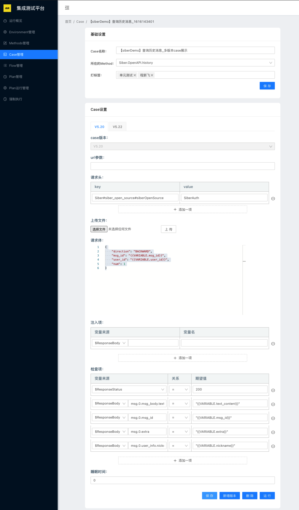

# 配置 case



## 基础配置

### **case 名称**

自定义的 case 名称，建议：见名知意。

case 名称全局唯一。

### **所在的 method**

在 method 管理界面注册过的method。

如果是通过 proto file 或者 GraphQuery 注册的method，会自动渲染初始结构。字段值默认为该类型的空值，或者指定的默认值：

```text
{
    "Token": "",
    "Url": "",
    "Ip": "",
    "System": "IM"
}
```

### 打标签

自定义标签，可用于标识：所属模块，使用范围等。

在 case 列表界面，可以根据标签进行搜索。

在做统计分析时，可以按照标签作为维度分析。

## case 设置

### case 版本

比如：接口 CreateUser 于2020年初上线 V1.0 版本后就一直没有变化，同时接口 UpdateUser 也于 2020年初上线 V1.0 版本，但分别于 2020 年末和上个月上线了 V1.1 和 V1.2 版本。

那么在配置 case 时，只需要对 UpdateUser 接口增加 V1.2 版本的配置。CreateUser 接口无需任何变动。

此时，如果 plan 选择 V1.2 版本运行，则会运行 V1.2 版本的 UpdateUser 和 V1.1 版本的 CreateUser；

如果 plan 选择 V1.1版本运行（比如私有部署，比如回滚回归），则会运行 V1.1 版本的 UpdateUser 和 V1.1 版本的 CreateUser。

即：**plan 会运行不高于自己版本的最高版本 case 。**

### **url 参数**

在许多 http（get、post） 请求中，参数是拼接在url 中的。此时，url 需要可以被参数渲染，例如，Commander \(来也科技业务线之一，详见：UIBot\)，在 siber 上的测试案例：“获得流程下所有数据指标统计” 中对于 url 参数的配置:

`?flowid={{VARIABLE.flow_id}}show`

**url 参数支持 parameter 渲染（ FUNCTION 和 VARIABLE 的解析）。**

### 请求头

支持 http（包括 GraphQL）、gRPC 两种协议的 request header。

**request header 支持 parameter 渲染（ FUCTION、VARIABLE 和 SiberAuth 的解析）。**

#### **SiberAuth**

使用 SiberAuth 可以支持对接口进行鉴权。当前已内置通用鉴权算法，可以自己在 siber 上添加自定义的鉴权算法。

通常而言，一个测试场景，我们倾向于使用一个用户从头测到尾（不妨碍你下次执行的时候换个不同权限的用户）。对于一个产品线，我们可以配置一个或多个用户进行测试。

**自定义鉴权算法的结构**


**三段式的 Key：**（以\#分隔）

Siber\#siber\_open\_source\#siberOpenSource

Siber : 用于标识产品线

siber\_open\_source：环境名，在环境管理中配置

siberOpenSource：应用配置名称，在环境管理中配置

**标识算法的 Value：**

SiberAuth 为内置鉴权算法（详见源码），如果有其他鉴权算法，诸如公司内部的自定义的算法，可以自由在源码上添加。

我们也鼓励大家向 Siber 提交代码。

**SiberAuth 的渲染示例：**

图片左边为请模板，及用户配置的内容。

右边为渲染后的内容，即实际发送的请求内容。


pubkey 在环境中的配置：


### 请求体

request body。**支持 parameter 渲染（ FUCTION、VARIABLE 和 SiberAuth ）。**

如果是通过 proto file 或者 GraphQuery（来也科技内部服务），配置的 method，在配置 case 基础信息的时候会自动渲染初始化 request body。字段值默认为该类型的空值，或者指定的默认值。

用户在此基础上修改即可。

### 上传文件


## 


## Siber

