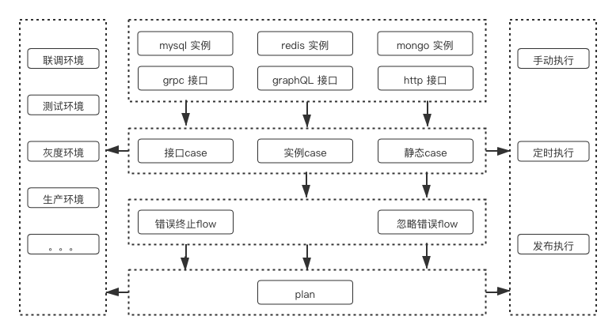

# 产品概述

## 产品概述

siber 是来也科技研发团队自主研发，面向接口的集成测试平台。覆盖 http、grpc、graphQL 三种常见类型接口测试。

siber 于2019年末在来也科技内部上线 V1.0 版本。当前已覆盖接口 600 余个，占总接口数量的 85% 以上；配置 case 3300 余个，case 执行次数达 230w 余次。

自 siber 上线以后，多次帮助产品、业务线发现不易察觉的问题，有效的规避了线上故障，极大的减轻了测试同学、私有部署同学回归测试的压力。

## 概念说明

<table>
  <thead>
    <tr>
      <th style="text-align:left">&#x672F;&#x8BED;</th>
      <th style="text-align:left">&#x542B;&#x4E49;</th>
    </tr>
  </thead>
  <tbody>
    <tr>
      <td style="text-align:left">&#x96C6;&#x6210;&#x6D4B;&#x8BD5;&#x5E73;&#x53F0;&#xFF08;siber&#xFF09;</td>
      <td
      style="text-align:left">&#x6765;&#x4E5F;&#x79D1;&#x6280;&#x7814;&#x53D1;&#x56E2;&#x961F;&#x81EA;&#x4E3B;&#x7814;&#x53D1;&#xFF0C;&#x9762;&#x5411;&#x63A5;&#x53E3;&#x7684;&#x96C6;&#x6210;&#x6D4B;&#x8BD5;&#x5E73;&#x53F0;&#x3002;</td>
    </tr>
    <tr>
      <td style="text-align:left">
        
&#x73AF;&#x5883;

        
env&#x3001;environment

      </td>
      <td style="text-align:left">
        
&#x8BF8;&#x5982;&#xFF1A;&#x5F00;&#x53D1;&#x3001;&#x6D4B;&#x8BD5;&#x3001;&#x7070;&#x5EA6;&#x3001;&#x751F;&#x4EA7;&#x3002;

        
&#x53EF;&#x4EE5;&#x9488;&#x5BF9;&#x4E0D;&#x540C;&#x4EA7;&#x54C1;&#x7EBF;&#x7684;&#x4E0D;&#x540C;&#x73AF;&#x5883;&#x914D;&#x7F6E;&#x4E0D;&#x540C;&#x7684;&#x5730;&#x5740;&#x3002;

      </td>
    </tr>
    <tr>
      <td style="text-align:left">
        
&#x63A5;&#x53E3;

        
method&#x3001;interface

      </td>
      <td style="text-align:left">
        
&#x5728;&#x6765;&#x4E5F;&#x79D1;&#x6280;&#x5185;&#x90E8;&#xFF0C;&#x901A;&#x5E38;&#x540C;&#x4E00;&#x4E2A;&#x63A5;&#x53E3;&#x6709;
          http &#x548C; gRPC &#x4E24;&#x79CD;&#x8C03;&#x7528;&#x65B9;&#x5F0F;&#x3002;

        
&#x5BF9;&#x5185;&#x4F7F;&#x7528; gRPC &#x534F;&#x8BAE;&#x3002;

        
&#x5BF9;&#x5916;&#x4F7F;&#x7528;&#x9700;&#x9274;&#x6743;&#x7684; http
          &#x534F;&#x8BAE;&#x3002;

      </td>
    </tr>
    <tr>
      <td style="text-align:left">
        
&#x6D4B;&#x8BD5;&#x6848;&#x4F8B;

        
case

      </td>
      <td style="text-align:left">
        
&#x4E00;&#x4E2A;&#x63A5;&#x53E3;&#x53EF;&#x4EE5;&#x5B58;&#x5728;&#x591A;&#x4E2A;&#x6D4B;&#x8BD5;&#x6848;&#x4F8B;&#x3002;

        
&#x901A;&#x8FC7;&#x914D;&#x7F6E;&#x68C0;&#x67E5;&#x9879;&#x68C0;&#x67E5;&#x63A5;&#x53E3;&#x6267;&#x884C;&#x7ED3;&#x679C;&#x662F;&#x5426;&#x7B26;&#x5408;&#x9884;&#x671F;&#x3002;

      </td>
    </tr>
    <tr>
      <td style="text-align:left">
        
&#x6D4B;&#x8BD5;&#x573A;&#x666F;

        
flow

      </td>
      <td style="text-align:left">
        
&#x7531;&#x4E00;&#x7CFB;&#x5217; case &#x7EC4;&#x6210;&#xFF0C;&#x6267;&#x884C;&#x65F6;&#x6309;&#x987A;&#x5E8F;&#x4F9D;&#x6B21;&#x6267;&#x884C;&#x3002;

        
&#x51FA;&#x9519;&#x540E;&#xFF0C;&#x53EF;&#x4EE5;&#x9009;&#x62E9;&#x201C;&#x7EE7;&#x7EED;&#x6267;&#x884C;&#x201D;&#x6216;&#x8005;&#x201C;&#x7EC8;&#x6B62;&#x6267;&#x884C;&#x201D;&#x3002;

      </td>
    </tr>
    <tr>
      <td style="text-align:left">
        
&#x6D4B;&#x8BD5;&#x8BA1;&#x5212;

        
plan

      </td>
      <td style="text-align:left">
        
&#x6709;&#x4E00;&#x4E2A;&#x6216;&#x591A;&#x4E2A; flow &#x7EC4;&#x6210;&#xFF0C;flow
          &#x95F4;&#x5E76;&#x53D1;&#x6267;&#x884C;&#x3002;

        
&#x9664;&#x624B;&#x52A8;&#x6267;&#x884C;&#x5916;&#xFF0C;&#x8FD8;&#x53EF;&#x4EE5;&#x914D;&#x7F6E;&#x201C;&#x5B9A;&#x65F6;&#x6267;&#x884C;&#x201D;&#x548C;&#x201C;CI&#x89E6;&#x53D1;&#x201D;&#x3002;

      </td>
    </tr>
    <tr>
      <td style="text-align:left">&#x68C0;&#x67E5;&#x9879;</td>
      <td style="text-align:left">&#x652F;&#x6301;&#x5BF9;&#x72B6;&#x6001;&#x7801;&#x3001;&#x54CD;&#x5E94;&#x65F6;&#x95F4;&#x3001;&#x8BF7;&#x6C42;&#x5934;&#x3001;&#x8BF7;&#x6C42;&#x4F53;&#x3001;&#x54CD;&#x5E94;&#x5934;&#x3001;&#x54CD;&#x5E94;&#x4F53;&#x7684;&#x5168;&#x90E8;&#x6216;&#x90E8;&#x5206;&#x6821;&#x9A8C;</td>
    </tr>
    <tr>
      <td style="text-align:left">&#x6CE8;&#x5165;&#x9879;</td>
      <td style="text-align:left"></td>
    </tr>
    <tr>
      <td style="text-align:left">&#x7761;&#x7720;&#x65F6;&#x95F4;</td>
      <td style="text-align:left"></td>
    </tr>
    <tr>
      <td style="text-align:left">
        
&#x53C2;&#x6570;

        
parameter

      </td>
      <td style="text-align:left"></td>
    </tr>
    <tr>
      <td style="text-align:left">
        
&#x53D8;&#x91CF;

        
variable

      </td>
      <td style="text-align:left"></td>
    </tr>
    <tr>
      <td style="text-align:left">
        
&#x81EA;&#x5B9A;&#x4E49;&#x9274;&#x6743;&#x7B97;&#x6CD5;

        
SiberAuth

      </td>
      <td style="text-align:left"></td>
    </tr>
    <tr>
      <td style="text-align:left">CI</td>
      <td style="text-align:left">
        
&#x6301;&#x7EED;&#x96C6;&#x6210;&#x3002;

        
&#x9879;&#x76EE;&#x53D1;&#x5E03;&#x540E;&#xFF0C;&#x5411; siber &#x53D1;&#x9001;&#x4FE1;&#x606F;&#xFF0C;siber
          &#x81EA;&#x52A8;&#x6216;&#x5F3A;&#x5236;&#x6267;&#x884C; plan&#x3002;

      </td>
    </tr>
    <tr>
      <td style="text-align:left">http</td>
      <td style="text-align:left">&#x8D85;&#x6587;&#x672C;&#x4F20;&#x8F93;&#x534F;&#x8BAE;&#x3002;</td>
    </tr>
    <tr>
      <td style="text-align:left">gRPC</td>
      <td style="text-align:left">
        
Google&#x53D1;&#x8D77;&#x7684;&#x4E00;&#x4E2A;&#x5F00;&#x6E90;&#x8FDC;&#x7A0B;&#x8FC7;&#x7A0B;&#x8C03;&#x7528;&#x7CFB;&#x7EDF;&#x3002;

        
&#x8BE5;&#x7CFB;&#x7EDF;&#x57FA;&#x4E8E;HTTP/2 &#x534F;&#x8BAE;&#x4F20;&#x8F93;&#xFF0C;&#x4F7F;&#x7528;Protocol
          Buffers &#x4F5C;&#x4E3A;&#x63A5;&#x53E3;&#x63CF;&#x8FF0;&#x8BED;&#x8A00;&#x3002;

      </td>
    </tr>
    <tr>
      <td style="text-align:left">GraphQL</td>
      <td style="text-align:left">&#x4E00;&#x4E2A;&#x5F00;&#x6E90;&#x7684;&#xFF0C;&#x9762;&#x5411;API&#x800C;&#x521B;&#x9020;&#x51FA;&#x6765;&#x7684;&#x6570;&#x636E;&#x67E5;&#x8BE2;&#x64CD;&#x4F5C;&#x8BED;&#x8A00;&#x4EE5;&#x53CA;&#x76F8;&#x5E94;&#x7684;&#x8FD0;&#x884C;&#x73AF;&#x5883;&#x3002;</td>
    </tr>
    <tr>
      <td style="text-align:left">
        
proto &#x6587;&#x4EF6;

        
proto file

      </td>
      <td style="text-align:left">&#x63CF;&#x8FF0;&#x6587;&#x4EF6;&#xFF0C;&#x7528;&#x4E8E;&#x63CF;&#x8FF0;
        gRPC &#x63A5;&#x53E3;&#x7684;&#x5B9A;&#x4E49;</td>
    </tr>
  </tbody>
</table>

## 产品亮点

在向你宣传 siber 之前，想请大家先思考几个问题：

* 每次上线前，是否对接口进行全量回归测试？
* 涉及到多种语言、协议时，如何测试他人的接口？
* 线上故障，想要回滚其中一个微服务时，如何确认对全局的影响？
* 对不同客户进行不同版本私有部署时，如何对接口的多版本进行测试？
* 测试、开发之间如何共享测试现场、清晰的展示及保存报错信息？
* 对于偶发问题如何进行有效监控？
* ……

对于上述问题，在来也科技内部，统一都使用集成测试平台（siber）来解决。接下来从产品层面向大家介绍下，siber 有哪些亮点：

### 规范的测试管理

#### 统一管理

所有接口测试需要的测试案例（case）、测试场景（flow）、测试计划（plan），都在 siber 上统一创建、维护、查看。避免出现_“你的脚本你知道，我的流程你不懂”等不友好交互的情况。_

用户之间可以共享 case、flow、plan。格式统一，全部使用 json 格式进行交互和校验，避免了_“ grpc 协议我不会调”，“前人用 go 写的测试脚本，但我更喜欢 python ”_等问题。

所以使用 siber 可以降低接口测试难度，提高测试案例的复用性。

#### 版本控制

敏捷开发模式下，产品迭代快。部分接口可能每次迭代都有改动，部分接口却可能两年都没有变化。

**那如何直观清晰的维护，同一个接口在不同版本下的 case 呢？**

siber 支持对同一个 case 配置不同版本的输入、输出及检查。可单独对有更新的接口对应的 case 增添版本，对于没变化的接口，无需额外处理。

当执行 plan 时，会自动执行不高于 plan 指定版本的最高版本 case。

详见：TODO

#### 整体复制

### 清晰的结果展示及持久化

### 健全的版本控制

### 可适配的 case 协议

### 丰富的 parameter

#### function

#### variable

#### 自定义的鉴权算法

### 全方位的触发机制

#### ci 触发

siber 已与来也科技内部 CI 工作流打通。当前支持两种 CI 触发模式：

1. 测试环境发布：**自动执行**_所有相关 plan_
2. 生产环境发布：**强制执行**_必要 plan_

自动执行：

强制执行：

#### crontab 触发

#### 手动触发

 ​

## 系统架构

 ​

## 相关链接

1. 试用 demo：
2. dockerhub：
3. github 地址：
4. 专利申请：[http://www.ipfeibiao.com/patent/view/2020106123674.html](http://www.ipfeibiao.com/patent/view/2020106123674.html)

